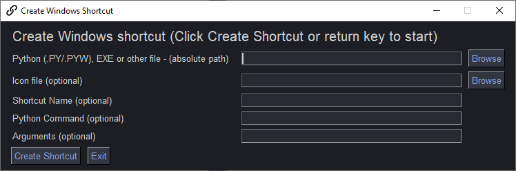

<p align="center">
  <p align="center"><p>

  <h2 align="center">psgshortcut</h2>
  <h2 align="center">A PySimpleGUI Application</h2>
</p>

PySimpleGUI Shortcut Tool

Creates Windows shortcuts


<p align="center"><p>


## Features

* Makes shortcuts for any file
* Shortcuts can be added to your desktop or pin to the taskbar
* Click (or double click) to launch the shortcut
* Enables interacting with Python programs more "Windows-like"

## Installation

### Using PIP

`pip install psgshortcut`

### Installing using `python -m pip`. The python recommended way:

#### If you use the command `python` on your computer to invoke Python (Windows):

```bash
python -m pip install --upgrade --no-cache-dir "git+https://github.com/PySimpleGUI/psgshortcut.git#egg=psgshortcut"
```

#### If you use the command `python3` on your computer to invoke Python (Linux, Mac):

```bash
python3 -m pip install --upgrade --no-cache-dir "git+https://github.com/PySimpleGUI/psgshortcut.git#egg=psgshortcut"`
```

## Usage

Once installed, launch psgshortcut by typing the following in your command line:

`psgshortcut`

## Create a Shortcut To This Program

Use this program to make a shortcut to itself so that you can then put
on your desktop or pin to your taskbar or ???


To do this, follow these steps:

1. Open a command window (I promise, it's the last time you'll need to for this program)
2. Type - `where psgshortcut`
3. Copy the line that `where psgshortcut` gave you into the first input of the shortcut maker program
4. Run psgshortcut by typing `psgshortcut` in your command window
5. Right click and choose "File Location"
6. Copy the file location results, but change the extension from .py to .ico and paste into the Icon file input of the shortcut maker
7. Click "Create Shortcut"

These steps will create a shortcut in the same folder as the target
file.  You can safely move this shortcut file any place you want (like
to your desktop). Double-click the shortcut and your program should
launch.

## Make Shortcuts To Anything

You can not only make shortcuts to Python programs, but you can make
shortcuts to EXE and other files.  The GUI is self-explanatory.  Fill
in the inputs, click the Make Shortcut button and you'll find the
shortcut in the same folder as the target program.

## Important Note - Pinning To Taskbar Requires "Python Command"

If you wish to pin your shortcut to the taskbar, then be sure to fill
in the "Python Command" field with the full path to your pythonw.exe
file.  Without it you'll get "IDLE" as the program that's pinned.  You
can skip filling in this field if you're going to place the shortcut
on your desktop or other location.

## License & Copyright

Copyright 2023-2024 PySimpleSoft, Inc. and/or its licensors.

This is a free-to-use "Utility" and is licensed under the
PySimpleGUI License Agreement, a copy of which is included in the
license.txt file and also available at https://pysimplegui.com/eula.

Please see Section 1.2 of the license regarding the use of this Utility,
and see https://pysimplegui.com/faq for any questions.


## Contributing

We are happy to receive issues describing bug reports and feature
requests! If your bug report relates to a security vulnerability,
please do not file a public issue, and please instead reach out to us
at issues@PySimpleGUI.com.

We do not accept (and do not wish to receive) contributions of
user-created or third-party code, including patches, pull requests, or
code snippets incorporated into submitted issues. Please do not send
us any such code! Bug reports and feature requests should not include
any source code.

If you nonetheless submit any user-created or third-party code to us,
(1) you assign to us all rights and title in or relating to the code;
and (2) to the extent any such assignment is not fully effective, you
hereby grant to us a royalty-free, perpetual, irrevocable, worldwide,
unlimited, sublicensable, transferrable license under all intellectual
property rights embodied therein or relating thereto, to exploit the
code in any manner we choose, including to incorporate the code into
PySimpleGUI and to redistribute it under any terms at our discretion.
